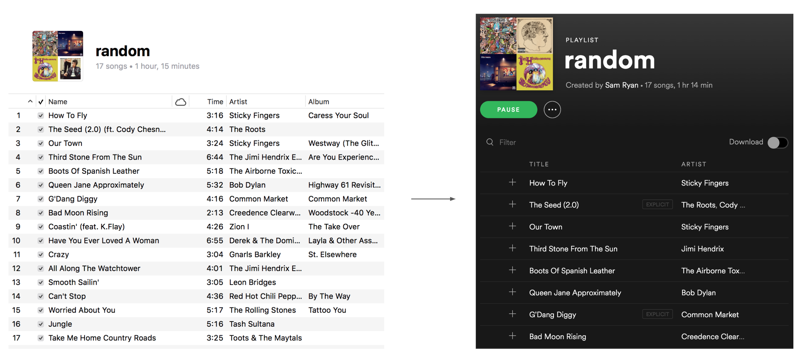

# iTunes to Spotify
Have old iTunes playlists of songs you downloaded (and maybe named poorly)?

This package converts iTunes playlists into Spotify playlists by searching Spotify for the songs in your iTunes playlist and adding them to a Spotify playlist. Works for most songs even if the name and artist are not written exactly how they appear in Spotify.

This project is in a live web app [here](http://itunes-to-spotify.herokuapp.com/).



Thanks to [spotipy](https://spotipy.readthedocs.io/en/latest/) for making a python version of the [spotify API](https://developer.spotify.com/documentation/web-api/) :)


---

### Instructions
1. Get spotify API credentials
    * Go to [spotify developer](https://developer.spotify.com/documentation/web-api/quick-start/) and create credentials
    * Change the name of `itunes_to_spotify/example_creds.py` to `itunes_to_spotify/creds.py` and fill it in with the appropriate user info

2. Export iTunes playlist as text file:
    * Highlight playlist in iTunes
    * File > Library > Export Playlist
    * Export as Unicode text (this creates a tab-delimited .txt file of iTunes playlist)

3. Create Spotify playlist and get a URI
    * Create a Spotify playlist
    * Click the three dots icon
        * hover over "Share"
        * click copy spotify URI

4. Installation (either of the two options below)
```
# normal installation 
$ sudo pip install git+https://github.com/samryan18/itunes-to-spotify.git
```

```
# installation for local development
# -e is editable flag
$ git clone https://github.com/samryan18/itunes-to-spotify.git
$ pip install -e itunes-to-spotify
```

5. Run to Create New Playlist
```
$ itunes_to_spotify_new [OPTIONS]

# Example (run with arguments in one go):
$ itunes_to_spotify_new --verbose --playlist_name="awesome playlist" --playlist_desc="description" --filepath="path_to_textfile"
```
A link will open asking you to login and allow the app to access your playlists.

---

### Options

##### Playlist Name [--playlist_name]
* Include `--playlist_name="playlist_name"` to specify name of new playlist
* Prompted for if not included

##### Playlist Description [--playlist_desc]
* Include `--playlist_desc="playlist_desc"` to specify description of new playlist
* Prompted for if not included

##### Path to iTunes playlist file [--filepath]
* Include `--filepath="path_to_textfile"` to specify filepath
* Prompted for if not included

##### Verbose [--verbose]
* Flag for whether to print info about the run
* Include `--verbose` to run in this mode

##### Help [--help]
* Run `$ itunes_to_spotify_new --help` for help.

---

## Optional: Run to Overwrite Existing Playlist
```
$ itunes_to_spotify [OPTIONS]

# Example (run with arguments in one go):
$ itunes_to_spotify --verbose --playlist_uri="playlist_uri" --filepath="path_to_textfile"
```
A link will open asking you to login and allow the app to access your playlists.

---

### Options

##### Playlist URI [--playlist_uri]
* Include `--playlist_uri="playlist_uri"` to specify playlist URI
* Prompted for if not included

##### Path to iTunes playlist file [--filepath]
* Include `--filepath="path_to_textfile"` to specify filepath
* Prompted for if not included

##### Verbose [--verbose]
* Flag for whether to print info about the run
* Include `--verbose` to run in this mode

##### Help [--help]
* Run `$ itunes_to_spotify --help` for help.
